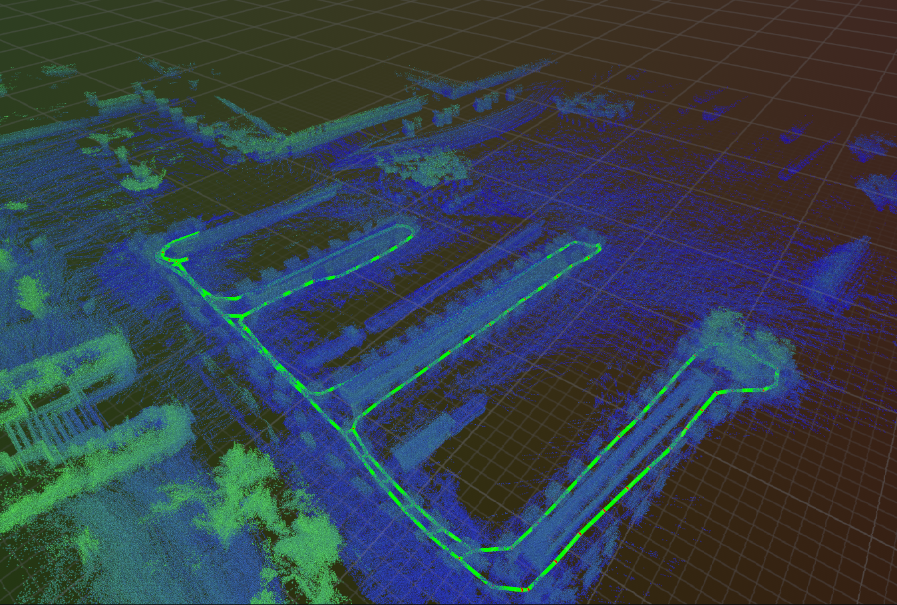

# rerun-viewmap
This is a map viewer for Spot using [Rerun](https://rerun.io/), please check official documentation or github for boston dynamics Spot SDK if you want to know about GraphNav.  
[GraphNav documentation](https://dev.bostondynamics.com/docs/concepts/autonomy/graphnav_service.html)  
[GraphNav official service and viewer](https://dev.bostondynamics.com/docs/concepts/autonomy/graphnav_service.html)  


## Build environment
Install the following packages:
```bash
pip install bosdyn-client
pip install rerun-sdk
```

## Run
```bash
python rerun_map_viewer.py --path <path_to_map_dir>
```

## History
- 2025/07/08
    - Initial commit
    - Add `rerun_map_viewer.py`

## Future work
- [ ] Add hover information in map viewer
- [ ] Control Spot using map viewer (implement `control.py`)